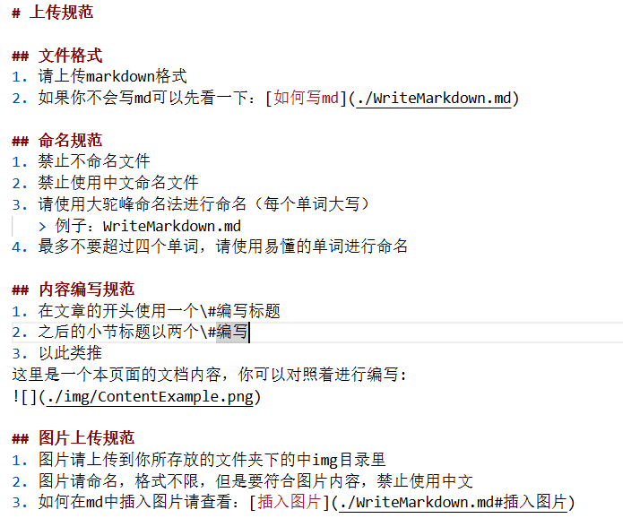

# 上传规范

## 文件格式
1. 请上传markdown格式
2. 如果你不会写md可以先看一下：[如何写md](./WriteMarkdown.md)

## 命名规范
1. 禁止不命名文件
2. 禁止使用中文命名文件
3. 请使用大驼峰命名法进行命名（每个单词大写）
   > 例子：WriteMarkdown.md
4. 最多不要超过四个单词，请使用易懂的单词进行命名

## 内容编写规范
1. 在文章的开头使用一个\#编写标题
2. 之后的小节标题以两个\#编写,以此类推    
- 这里是一个本页面的文档内容，你可以对照着进行编写:

## 图片上传规范
1. 图片请上传到你所存放的文件夹下的中img目录里
2. 图片请命名，格式不限，但是要符合图片内容，禁止使用中文
3. 如何在md中插入图片请查看：[插入图片](./WriteMarkdown.md#插入图片)

## 板块划分
1. **新手入门（guide）部分**：主要包括新手技巧，如果想做这一部分的内容请联系墨安和布染
2. **进阶技巧（advanced）部分**：主要包括进阶技巧，你可以在这里添加任何相关内容
3. **资源中心（resources）部分**：主要包括速通资源及其下载链接、使用方法的整理
4. **贡献（contribute）部分**：为贡献者提供教程以及规范，如有修改建议请联系墨安