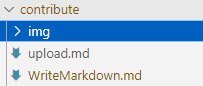

# 如何写Markdown

在本页您将学习到如何写markdown文件
请注意，文字换行请在行后添加两个空格

## 标题

````md
# 一级标题
## 二级标题
### 三级标题
...
````

最多可以有六级标题也就是六个#  
md符号和文字之间注意空格    
一份md文件建议使用一个一级标题，小标题使用二级标题

# 一级标题
## 二级标题
### 三级标题

## 加粗

````md
**我是加粗**
````   

**我是加粗**

## 倾斜
````md
*我是倾斜*
````   

*我是倾斜*

## 超链接
````md
[bilibili](https://www.bilibili.com/)
````

[bilibili](https://www.bilibili.com/)

## 链接其他文章
````md
[我是链接](./WriteMarkdown.md#链接其他文章)
````

[我是链接](./WriteMarkdown.md#链接其他文章)

## 插入图片
````md

````

  
上传内容时，请把图片上传至当前目录的img文件夹里

## 表格
````md
|    左对齐     |     居中      | 右对齐 |
| ------------  | :-----------: | ----: |
| 草莓麻薯      |  All Advancement | 00:00 |
| 八人二三伞散   | SSG           | 00 |
| 速通机器      | FSG           | 0 |
````

你可以为了美观进行对齐，但实际显示的时候会自动对齐  
如何左对齐、居中、右对齐请看第二行  


|    左对齐     |     居中      | 右对齐 |
| ------------  | :-----------: | ----: |
| 草莓麻薯      |  All Advancement | 00:00 |
| 八人二三伞散   | SSG           | 00 |
| 速通机器      | FSG           | 0 |

## 自定义容器


```md
::: info
This is an info box.
:::

::: tip
This is a tip.
:::

::: warning
This is a warning.
:::

::: danger
This is a dangerous warning.
:::

::: details
This is a details block.
:::
```


::: info
This is an info box.
:::

::: tip
This is a tip.
:::

::: warning
This is a warning.
:::

::: danger
This is a dangerous warning.
:::

::: details
This is a details block.
:::
